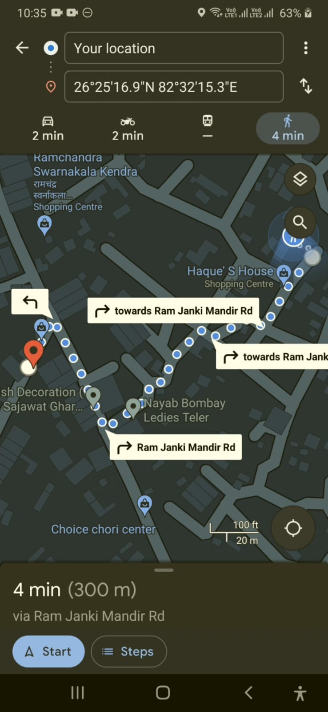

# TrackMyCart -Merchant
- The Street Vendors digitalization Project - Walk less Earn More

### How to Run Code
Clone or download the repo and place it anywhere in your computer. Open the folder in Android Studio or VS Code. Make sure that you have flutter SDK already installed. Type the command in terminal:

"flutter pub get"

After the command is run successfully you can run the app on real device or on emulator by pressing the Play button in Android Studio or by pressing F5 in VS Code.
# Features
### 1. On Starting the app it show splash screen for 3 seconds
  
  
### 2. After this it navigate to the login page
   

### 3. In case you dont have login credentials , you can click below "Sign up" it will redirect to the sign up page, after creating id it will redirect back to Sign in page

### Sign up page is divided into 3 subpart a.Your Info b.Input Credential c.Cart Info
   

### 4. After login merchant will redirected  to his profile where he can see the description and images uploaded by him, 
### 5.Every merchant profile have a location button at the bottom, which will open Google maps and provide the location of the merchant , after this you can start navigation 
### 6. After starting navigation you can proceed to the destination.
### 7. We Also provide a app drawer, which appear on swip L to R, which provide option to Sign out of the app.

## Screenshots...
  1.  &nbsp;&nbsp;&nbsp;&nbsp;&nbsp;&nbsp;&nbsp;&nbsp;&nbsp;&nbsp; 2.  &nbsp;&nbsp;&nbsp;&nbsp;&nbsp;&nbsp;&nbsp;&nbsp;&nbsp;&nbsp;  
  &nbsp;&nbsp;&nbsp;&nbsp;&nbsp;&nbsp;&nbsp;&nbsp;&nbsp;&nbsp; 
 3(a).  &nbsp;&nbsp;&nbsp;&nbsp;&nbsp;&nbsp;&nbsp;&nbsp;&nbsp;&nbsp; 3(b).  &nbsp;&nbsp;&nbsp;&nbsp;&nbsp;&nbsp;&nbsp;&nbsp;&nbsp;&nbsp; 3(c).  
  &nbsp;&nbsp;&nbsp;&nbsp;&nbsp;&nbsp;&nbsp;&nbsp;&nbsp;&nbsp; 
4.  &nbsp;&nbsp;&nbsp;&nbsp;&nbsp;&nbsp;&nbsp;&nbsp;&nbsp;&nbsp; 5. 
&nbsp;&nbsp;&nbsp;&nbsp;&nbsp;&nbsp;&nbsp;&nbsp;&nbsp;&nbsp; 6. &nbsp;&nbsp;&nbsp;&nbsp;&nbsp;&nbsp;&nbsp;&nbsp;&nbsp;&nbsp; 7.  &nbsp;&nbsp;&nbsp;&nbsp;&nbsp;&nbsp;&nbsp;&nbsp;&nbsp;&nbsp; 

And that was all about the Application of this repository, Thanks for watching............................... 
and In order to watch the User side app [click here](https://github.com/smv8960/trackmycart)
